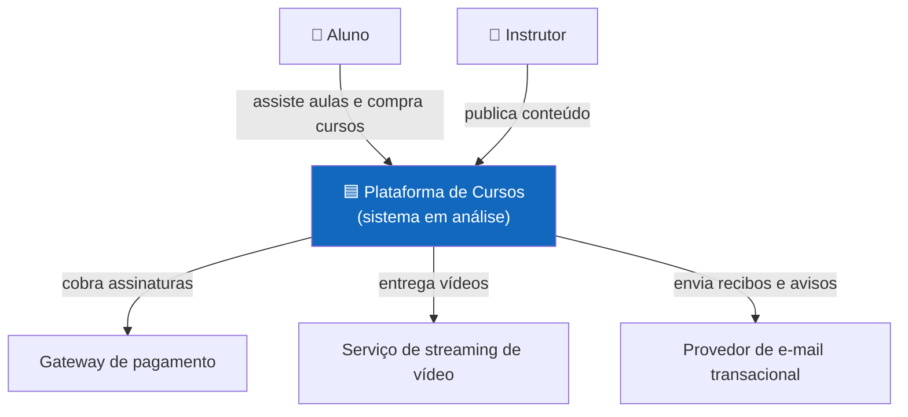
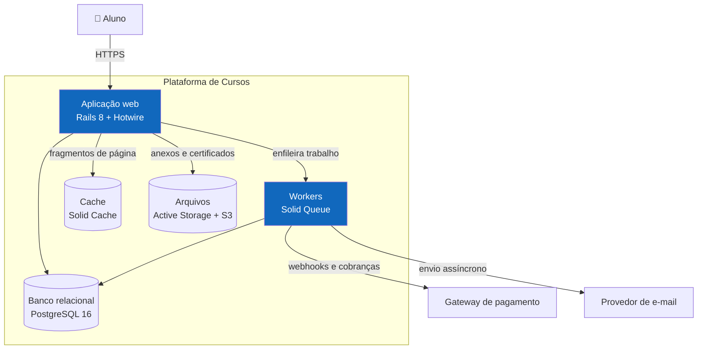
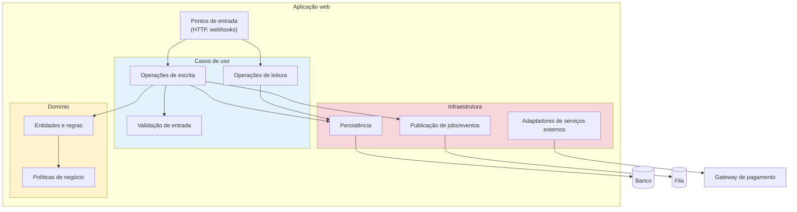
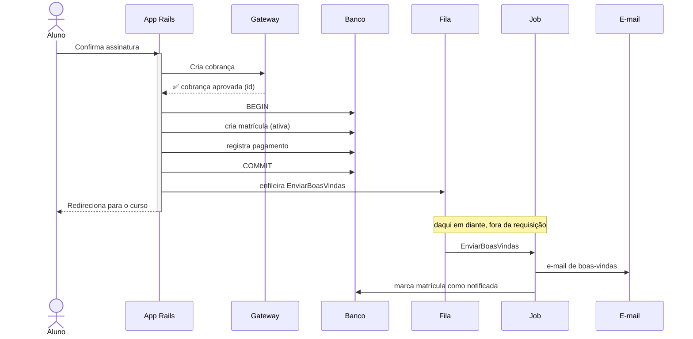
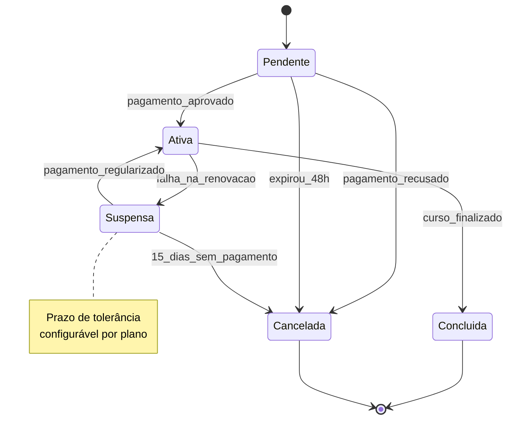

# Diagramas C4 em Mermaid

Modelos prontos para copiar e adaptar. `flowchart` atende aos níveis 1, 2 e 3; `sequenceDiagram` explica fluxos; `stateDiagram-v2` mostra ciclos de vida. O nível 4 (código) quase nunca vale o esforço — quem quer ver classes abre o código.

O domínio usado nos exemplos é uma plataforma de cursos online, só para dar concretude.

## Nível 1 — Contexto

O sistema aparece como uma caixa fechada. Mostre quem o usa e com quem ele conversa — nada do que existe dentro dele.

**Para ficar legível:**
- Pinte o sistema em análise com uma cor que o destaque
- Escreva na seta o que acontece (um verbo), não deixe a linha muda
- Pessoas em cima; sistemas externos dos lados ou embaixo
- Fique perto de 7 elementos — mais que isso satura

## Nível 2 — Containers

Abre a caixa e mostra o que é implantado separadamente: aplicação web, workers, banco, cache, filas.

**Para ficar legível:**
- Tecnologia e versão no rótulo, depois de ` `
- Bancos, caches e filas como cilindro: `[(...)]`
- Protocolo ou formato na seta quando isso ajudar a decisão
- Sistemas externos fora do `subgraph`

## Nível 3 — Componentes

Lupa sobre **um** container. Só desenhe quando a organização interna influencia uma decisão — normalmente no container de domínio mais complexo.

O exemplo abaixo usa nomes de papéis (não de bibliotecas), para mostrar agrupamento lógico sem prescrever um estilo. A versão com classes reais de uma aplicação Rails está em `${CLAUDE_PLUGIN_ROOT}/stacks/rails/c4-component-example.md`.

**Para ficar legível:**
- Use `subgraph` para agrupar (camadas, módulos, bounded contexts)
- Uma cor por grupo ajuda o olho
- Nada de classes individuais — isso já seria nível 4
- Esse agrupamento é ilustração, não recomendação: separar em camadas tem custo e só compensa em certos contextos (ver `architectural-styles.md`)

## Sequência — fluxos que precisam de explicação

Para um a três fluxos em que o desenho de containers não basta. Fluxo CRUD previsível não precisa.

**Para ficar legível:**
- `activate`/`deactivate` mostram o trecho síncrono
- `Note` marca a passagem para o assíncrono
- Respostas com seta tracejada (`-->>`)
- Mais de 7 participantes atrapalha a leitura

## Estados — ciclo de vida de uma entidade

Útil quando boa parte da arquitetura existe para controlar as transições de uma entidade (matrícula, pedido, contrato, chamado).

## Erros que tiram o valor do diagrama

- ❌ **Excesso de caixas** — passou de ~15 elementos num mesmo nível, divida em diagramas ou suba um nível.
- ❌ **Níveis misturados** — containers e componentes no mesmo desenho confundem o leitor.
- ❌ **Setas sem rótulo** — toda seta deve dizer o que passa por ela (requisição, evento, dado).
- ❌ **Tecnologia no contexto** — o nível 1 é caixa fechada; tecnologia aparece a partir do nível 2.
- ❌ **Desenho sem pergunta** — se o leitor não tira nenhuma conclusão arquitetural dele, o diagrama não precisa estar na proposta.
