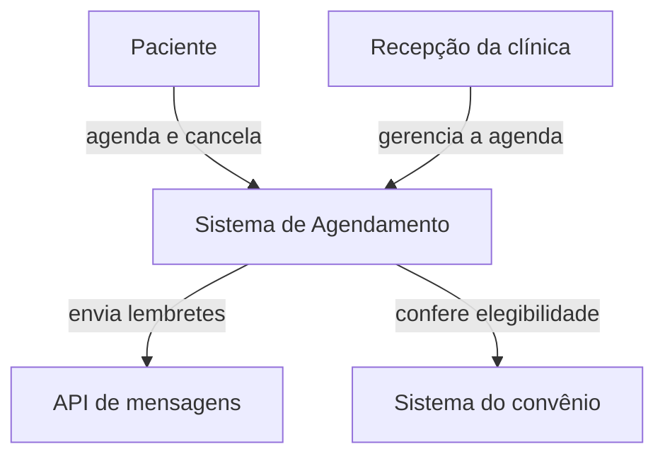
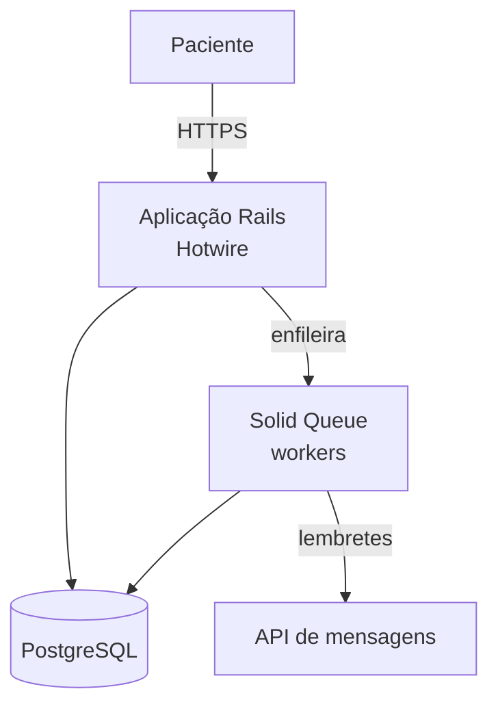
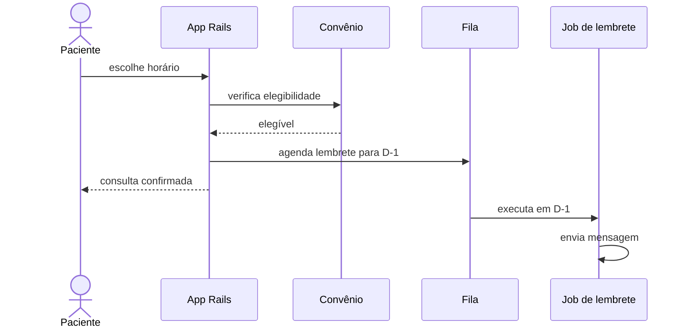

# Modelo — Proposta Arquitetural

Estrutura a preencher pela skill `sdd-architect`. A ordem das seções é fixa; seções que não se aplicam podem sair, desde que nada seja inventado para ocupar espaço. As decisões detalhadas **não** ficam aqui: cada uma vira um arquivo próprio, conforme `adr-template.md`, e esta proposta apenas as indexa.

> Sobre as cercas: as quatro crases que abrem e fecham o bloco abaixo só delimitam o modelo dentro deste arquivo e não vão para o documento final. As cercas de três crases que aparecem dentro dele fazem parte do documento.

---

````markdown
# Proposta Arquitetural — [nome do sistema]

> Responsável: [pessoa ou time] · Criada em [AAAA-MM-DD] · Versão 0.1 · Status: Rascunho

## 1. Resumo para decisão

[Até uma página, para quem não é técnico. Precisa responder:]

- O que será construído, numa frase
- A ideia central que justifica a arquitetura escolhida
- Os maiores riscos e o que fazemos a respeito
- Limites de orçamento ou de data **informados pelo cliente**, se existirem (ver seção 4). Esta proposta não calcula esforço nem prazo — ver seção 12

---

## 2. Negócio

### 2.1 O problema
[O que dói hoje, para quem, e o que acontece se nada for feito.]

### 2.2 Resultados esperados
[Frases curtas e, sempre que der, mensuráveis.]
- [resultado 1]
- [resultado 2]

### 2.3 Fora do escopo
[O que este sistema deliberadamente não vai fazer.]
- [item fora do escopo]

### 2.4 Público e volume
[Quem usa, quanto e como. Ordem de grandeza é suficiente.]

---

## 3. Qualidades que dirigem a arquitetura

[Somente as 2 a 4 que pesam de verdade. Para cada uma:]

### 3.1 [Qualidade — ex.: Disponibilidade]
- **Meta**: [ex.: agenda acessível 99,5% do mês em horário comercial]
- **Motivo**: [qual resultado de negócio depende disso]
- **Resposta da arquitetura**: [uma frase; o detalhe vem nas seções 5 e 6]

[repetir por qualidade]

---

## 4. Restrições

[O que foi dado, não escolhido.]

| Tipo | Restrição | De onde vem |
| --- | --- | --- |
| Tecnologia | [ex.: backend em Rails] | [ex.: conhecimento do time atual] |
| Regulação | [ex.: dados de saúde sob LGPD] | [ex.: legislação] |
| Infraestrutura | [ex.: AWS] | [ex.: contrato corporativo] |
| Pessoas | [ex.: 3 devs, 1 sênior] | [ex.: time disponível] |

---

## 5. Decisões arquiteturais

[Índice das decisões. O conteúdo completo de cada uma está no arquivo do ADR. Os IDs ligam esta proposta ao PRD, ao plano e ao review — nunca renumere. Uma decisão substituída continua na tabela com o novo status.]

| ADR | Decisão | Status | Arquivo |
| --- | --- | --- | --- |
| ADR-001 | [ex.: Monolito modular em Rails com módulos por domínio] | Proposto | [adrs/ADR-001-monolito-modular.md](adrs/ADR-001-monolito-modular.md) |
| ADR-002 | [ex.: Jobs assíncronos com Solid Queue] | Proposto | [adrs/ADR-002-jobs-com-solid-queue.md](adrs/ADR-002-jobs-com-solid-queue.md) |

[Em uma ou duas frases, diga o fio condutor que liga essas decisões.]

---

## 6. Visão da arquitetura

[Comece dizendo quais níveis do C4 foram usados e por quê. Modelos Mermaid em `c4-mermaid-templates.md`.]

> **Níveis usados:** 1 (contexto) e 2 (containers). O nível 3 ficou de fora porque cada container tem estrutura interna simples.

### 6.1 Contexto (C4 nível 1)



[Explique o porquê das relações, não o que o desenho já mostra.]

### 6.2 Containers (C4 nível 2)



[Para cada container: o que faz, com qual tecnologia, por que essa tecnologia e como é implantado.]

### 6.3 Componentes (C4 nível 3) — se necessário

[Só para o container que precisa de zoom. Pule se ele for comum.]

---

## 7. Fluxos que merecem desenho

[De 1 a 3 fluxos em que a arquitetura não é óbvia. CRUD trivial não entra.]

### 7.1 [nome do fluxo — ex.: Confirmação de consulta]



[Por que o fluxo foi desenhado assim e não de outra forma.]

---

## 8. Trade-offs aceitos

[Para cada tensão relevante, o lado escolhido e o motivo.]

- **[Qualidade A] × [Qualidade B]**: ficamos com [A] porque [motivo ligado ao negócio]. O preço é [consequência].
- **[Qualidade C] × [Qualidade D]**: [...]

---

## 9. Dívidas técnicas conscientes

[O que foi adiado de propósito e terá de ser resolvido depois.]

- **[Dívida]**
  - **Vira problema quando**: [gatilho — ex.: mais de 30 clínicas ativas]
  - **Caminho para quitar**: [estratégia em alto nível]

---

## 10. Riscos

| Risco | Impacto | Probabilidade | Resposta |
| --- | --- | --- | --- |
| [ex.: API do convênio instável] | Alto | Média | [ex.: cache de elegibilidade + validação manual como plano B] |

---

## 11. Próximos passos de validação

[Ordem lógica para confirmar a arquitetura — não é cronograma.]

1. [ex.: prova de conceito da integração mais arriscada]
2. [decisão que ainda depende de informação]
3. [ex.: ambiente, CI e deploy inicial]

---

## 12. Fora deste documento

[O que não foi tratado aqui e onde será.]

- Modelagem de ameaças detalhada → documento próprio de segurança
- Estimativas e cronograma → `/spike` e planejamento do time
- Interface e identidade visual → SPEC-UI (`sdd-prototype`) e ferramenta de design
````
