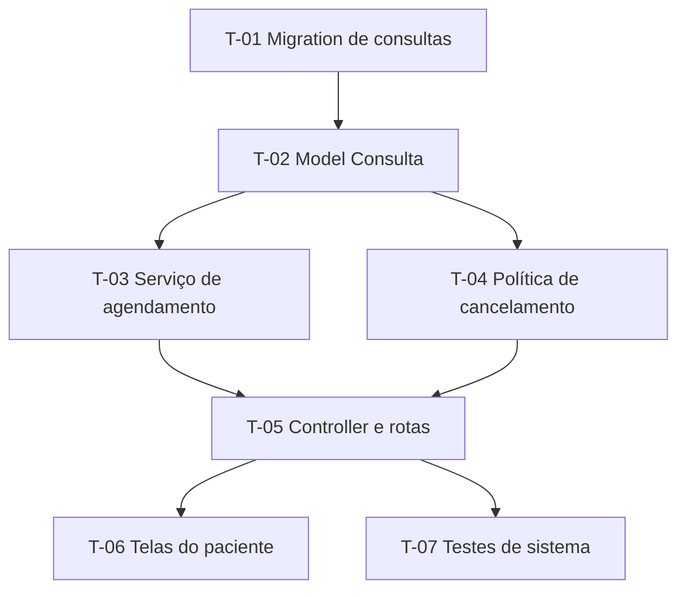

# Modelo — Plano de Execução

Estrutura preenchida pela skill `sdd-plan`. Ordem e níveis de título são fixos; seções sem aplicação podem sair, exceto as marcadas como **obrigatória**.

> Sobre as cercas: as quatro crases externas só delimitam o modelo; as cercas de três crases internas fazem parte do documento.

---

````markdown
# PLAN-XXX: [mesmo título do PRD]

- **PRD:** `docs/sdd/prds/PRD-XXX-tema.md`
- **SPEC-UI:** `docs/sdd/prototype/SPEC-UI-XXX-tema.md` *(se houver)*
- **Stack:** [ex.: Ruby 3.3 / Rails 8.0, PostgreSQL 16, Hotwire, RSpec]
- **Responsável:** [nome]
- **Data:** [AAAA-MM-DD]
- **Status:** Rascunho
- **Estimativa total (informada pelo usuário):** [vazio, ou o valor que o usuário deu]

---

## 1. Resumo — obrigatória

[Um parágrafo: o que será construído e a lógica geral da quebra. Ex.: "Começa pelo modelo de dados e pelas regras de agendamento, expõe pelas telas do paciente e termina com o painel da recepção, tudo atrás de uma feature flag."]

## 2. Como vai para produção — obrigatória

- **Modelo de entrega:** [entrega única / por fases / atrás de feature flag]
- **Pronto significa:** [o que precisa ser verdade para dar a funcionalidade por terminada — em geral: critérios do PRD verificáveis, testes verdes, review aprovado, validação em homologação]

## 3. Premissas e decisões — obrigatória quando houver

Cada premissa escrita de forma que, se ela se mostrar falsa, fique claro que o plano muda.

> ⚠️ **Premissa:** [descrição]

Decisões já tomadas que moldam o plano:

- [decisão] — ver `ADR-XXX`

## 4. Dependências — obrigatória com mais de 5 tarefas



## 5. Fases — obrigatória

Uma fase agrupa tarefas que, juntas, entregam algo coerente e podem ser interrompidas sem deixar o sistema quebrado. Divisão típica:

- **Fase 1 — Base:** migrations, models, contratos
- **Fase 2 — Regras:** objetos de serviço, validações, políticas
- **Fase 3 — Exposição:** controllers, rotas, API, autenticação e autorização
- **Fase 4 — Interface:** views, componentes, Stimulus. Com SPEC-UI, cada tarefa declara `Telas:`; componentes listados como repetidos na SPEC-UI viram tarefa própria, usada pelas tarefas de composição
- **Fase 5 — Qualidade e operação:** testes de sistema, logs, métricas, feature flag

Ajuste à funcionalidade: algo pequeno pode ter 2 fases; algo grande, 6. Quando a conversa apontou entrega incremental real ou risco de integração, parte das fases pode ser cortada na vertical (uma fatia por `CA-XX`) — ver "Corte horizontal ou vertical" no `SKILL.md` e o Exemplo 6 de `task-examples.md`.

### Fase 1 — [nome]

- **Objetivo:** [uma frase]
- **Fecha quando:** [condição para encerrar a fase]

---

#### T-01 — [ação curta no imperativo]

- **Status:** Pendente
- **Complexidade:** [Baixa / Média / Alta]
- **Estimativa:** *(vazio — preenchido apenas com o valor informado pelo usuário)*
- **Depende de:** [nenhuma | T-XX, T-YY]
- **Implementa:** [RN-XX, RN-YY] *(regras que a tarefa coloca em código; em tarefa sem regra, `estrutural — <motivo>`)*
- **Valida:** [CA-XX] *(cenários que ficam verdes ao concluir; vazio em tarefa preparatória)*
- **Decisões base:** [ADR-XXX] *(opcional; apenas ADRs com status Aceito)*
- **Telas:** [UI-XX (estados)] *(só em tarefa de interface de projeto com SPEC-UI)*
- **Arquivos/camadas:**
  - `db/migrate/AAAAMMDDHHMMSS_create_consultas.rb` *(novo)*
  - `app/models/consulta.rb` *(novo)*

**O que fazer:**
[2 a 4 linhas de direção — não código. As regras já estão em `Implementa:`; aqui entram as nuances de implementação.]

**Critério de aceite (testável):**
- [ ] [critério verificável por teste ou inspeção objetiva]
- [ ] [critério]

**Testes a escrever:**
- *Unidade:* [ex.: "model rejeita consulta sem horário"]
- *Integração/requisição:* [ex.: "POST /consultas cria a consulta e retorna 201 (CA-01)"]
- *Sistema:* [ex.: "paciente agenda pela tela (CA-01)"]
- *Não se aplica* quando a tarefa é puramente estrutural.

Nomes dos testes que provam cenários seguem a convenção do projeto em `docs/sdd/config.yml` (ex.: `it "CA-01: ..."`).

**Riscos / atenção:**
- [ex.: "tabela com 3 milhões de linhas — índice criado com `algorithm: :concurrently`"]

> **Status aceitos (texto exato):** `Pendente` | `Em andamento` | `Concluído` | `Bloqueado` | `Cancelado`, sem emoji. `sdd-next` e
> `sdd-trace` leem o campo literalmente — outra grafia esconde a tarefa. O mesmo vale para a coluna Status do
> histórico (seção 11). Referência: `templates/id-conventions.md`.

---

#### T-02 — [...]

[mesma estrutura]

---

### Fase 2 — [nome]

[mesma estrutura, continuando a numeração]

## 6. Testes que atravessam tarefas (opcional)

- [ ] **Ponta a ponta:** [descrição]
- [ ] **Carga:** [cenário e limite esperado, se fizer sentido]
- [ ] **Regressão:** [áreas vizinhas a revalidar]

## 7. Pronto para produção — obrigatória

- [ ] Critérios de aceite do PRD verificados
- [ ] Cobertura de testes no padrão do projeto
- [ ] Review aprovado por ao menos uma pessoa
- [ ] Migrations testadas em ambiente semelhante ao de produção (se houver)
- [ ] Logs estruturados nos pontos críticos
- [ ] Feature flag configurada (se o modelo de entrega pedir)
- [ ] Documentação atualizada (README, `AGENTS.md`, ADR novo se houve decisão)
- [ ] Validação em homologação com quem dá o aceite
- [ ] Plano de reversão escrito (principalmente se houver migration destrutiva)

## 8. Reversão — obrigatória com migration ou mudança incompatível

[Como desfazer em produção:
- como reverter as migrations (ou se elas são só para frente)
- como desligar pela feature flag
- que dados ficam inconsistentes e como conciliar]

## 9. Pontos de validação humana — obrigatória

Momentos em que quem executa — principalmente um agente — **para e pede confirmação**:

- [ ] Depois da **T-XX** (migration criada) — revisar o SQL antes de aplicar em ambiente compartilhado
- [ ] Ao fim da **Fase N** — revisar as regras com quem dá o aceite antes de expor
- [ ] Antes da **T-YY** (deploy em homologação) — confirmar que a flag nasce desligada

## 10. Pontos em aberto (opcional)

- [ ] [pergunta] — responsável: [nome] — bloqueia: T-XX

## 11. Histórico de execução — preenchido durante a execução

Atualizado a cada tarefa; é o que permite retomar o trabalho em outra sessão ou ferramenta. A coluna Status usa o mesmo vocabulário do campo da tarefa e precisa concordar com ele — o `sdd-trace` aponta divergências.

| Tarefa | Status | Data | Commit | Observação |
| --- | --- | --- | --- | --- |
| T-01 | Concluído | 2026-10-08 | `a1b2c3d` | — |
| T-02 | Em andamento | — | — | — |
| T-03 | Bloqueado | — | — | R-01 (REVIEW-T-03-2026-10-09) |
````
