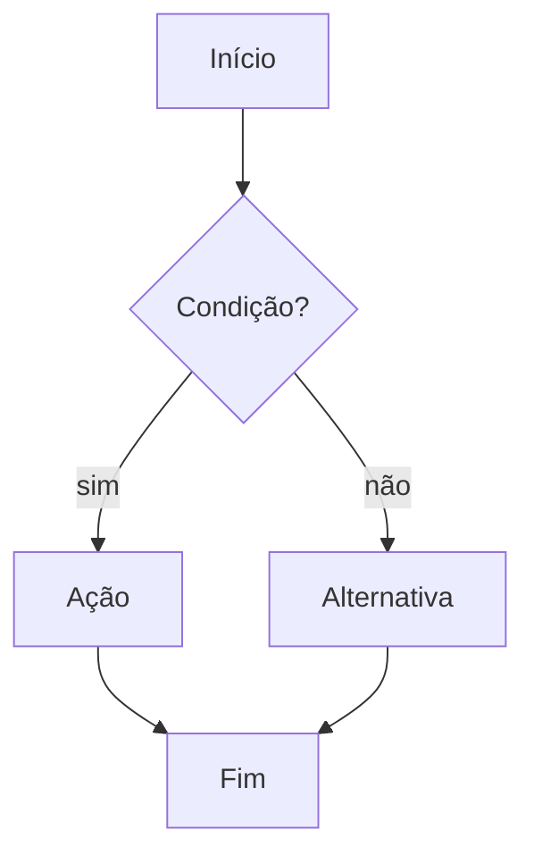
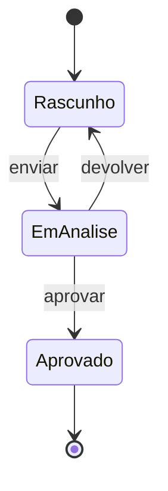
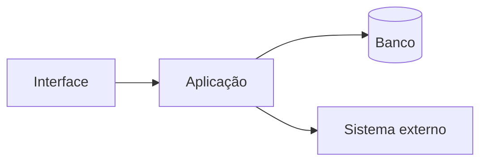

# Modelo — PRD

Estrutura que a skill `sdd-prd` preenche. A ordem e os níveis de título são fixos. Seções marcadas como **obrigatória** sempre aparecem; as demais entram quando fazem sentido.

> Sobre as cercas: as quatro crases externas só delimitam o modelo. As cercas de três crases internas fazem parte do documento gerado.

---

````markdown
# PRD-XXX: [nome da demanda]

- **Produto/sistema:** [nome]
- **Nível:** [Épico / Funcionalidade / História]
- **Card de origem:** [chave ou link no board, se houver]
- **Responsável:** [nome]
- **Data:** [AAAA-MM-DD]
- **Status:** Rascunho

---

## 1. Resumo — obrigatória

[Um parágrafo que um dev recém-chegado entenda em meio minuto. Termos de negócio explicados.]

## 2. Problema — obrigatória

- **O que dói:** [o problema concreto]
- **Como é hoje:** [processo ou sistema atual, se houver]
- **Se não fizermos:** [consequência de ignorar]

## 3. Objetivo — obrigatória

[Uma frase começando com verbo no infinitivo: "Permitir…", "Reduzir…", "Automatizar…".]

### Como medir o sucesso (opcional)

[Indicadores, se existirem. Ex.: "metade dos cancelamentos feitos sem contato com a recepção".]

## 4. Escopo — obrigatória

### 4.1 Entra

- [item]

### 4.2 Não entra

- [item — com o motivo, quando ajudar]

## 5. Quem usa — obrigatória quando há interface

| Perfil | Papel | O que faz com a funcionalidade |
| --- | --- | --- |
| [perfil] | [papel] | [resumo] |

## 6. Quebra para o board — obrigatória

Proposta de organização em épico → funcionalidade → história:

- **Épico:** [cobre a demanda inteira e entrega um resultado de negócio]
  - **Funcionalidade:** [bloco funcional coerente]
    - **História:** [menor entrega com valor perceptível]
    - **História:** [...]
  - **Funcionalidade:** [...]
    - **História:** [...]

> Proposta, não imposição — quem prioriza o backlog pode reorganizar.
>
> **História não é tarefa.** Uma história do board costuma levar dias; uma `T-XX` do plano cabe entre 30 minutos e 4 horas (`templates/id-conventions.md`). O `sdd-plan` quebra cada história em várias tarefas.

## 7. Fluxos — obrigatória quando há interação

### 7.1 Caminho principal



[O mesmo fluxo em passos numerados.]

### 7.2 Desvios e erros

[Um diagrama por desvio complexo; texto para os simples.]

## 8. Regras de negócio — obrigatória

Cada regra com ID, verificável, e com o ADR que a motiva entre parênteses quando houver.

- **RN-01:** [regra clara e testável]
- **RN-02:** [regra] (ADR-002)
- **RN-03:** [regra]

## 9. Critérios de aceite — obrigatória

Cenários Gherkin no idioma do documento. O ID `CA-XX` vai entre colchetes no título do cenário; os passos citam as regras que exercitam. Cada cenário se sustenta sozinho.

```gherkin
# language: pt
Funcionalidade: [nome]

  Cenário [CA-01]: [o que este cenário comprova]
    Dado que [situação inicial] (RN-01)
    E [complemento]
    Quando [ação ou evento]
    Então [resultado esperado] (RN-03)
    E [resultado adicional]

  Cenário [CA-02]: [variação ou erro]
    Dado que [...]
    Quando [...]
    Então [...]
```

No mínimo: caminho feliz, variações principais e os erros mais prováveis. Referências em `gherkin-examples.md`.

## 10. Permissões — obrigatória quando há controle de acesso

| Ação | Quem pode | Observação |
| --- | --- | --- |
| [ação] | [perfis] | [regra extra, se houver] |

## 11. Dados e integrações — obrigatória quando se aplica

### 11.1 Sistemas envolvidos
- [sistema] — [como conversa: API, webhook, fila, evento]

### 11.2 O que é lido
[Dados consumidos e de onde vêm.]

### 11.3 O que é gravado
[Dados produzidos e onde ficam.]

### 11.4 Eventos (opcional)
[Nome e conteúdo conceitual de cada evento publicado ou consumido.]

## 12. Estados da entidade (opcional)

Quando a entidade principal tem ciclo de vida relevante.



## 13. Encaixe técnico (opcional)

Visão de alto nível de onde a funcionalidade entra no sistema. Sem classes nem detalhes de implementação.



## 14. Restrições e premissas (opcional)

- **Restrição:** [ex.: resposta em menos de 1s]
- **Premissa:** [ex.: o cliente já possui cadastro]

## 15. Riscos e dependências — obrigatória

| Tipo | Descrição | Resposta / plano B |
| --- | --- | --- |
| Risco | [descrição] | [mitigação] |
| Dependência | [time, fornecedor, decisão] | [situação / alternativa] |

## 16. Pontos em aberto (opcional)

- [ ] [pergunta] — responsável: [nome]

## 17. Referências (opcional)

- [card, conversa, protótipo, documento]
- [proposta arquitetural: `docs/sdd/architecture/proposta-arquitetural.md`]
- [ADRs citados: `docs/sdd/architecture/adrs/ADR-XXX-*.md`]

## 18. Revisões (obrigatória depois da primeira mudança no PRD aprovado)

[Uma linha por revisão, feita pelo `sdd-change` (ou pelo `sdd-bug`, quando ele acrescenta um cenário). Notação: `+` novo, `~` alterado, `−` revogado. Regra em `templates/id-conventions.md`, "Revisões de PRD e SPEC-UI". Sem revisões, remova a seção.]

| Nº | Data | O que mudou | IDs | Motivo / origem |
| --- | --- | --- | --- | --- |
| 1 | [AAAA-MM-DD] | [resumo] | [+RN-XX, ~CA-XX, −CA-XX] | [pedido, card ou BUG-<CHAVE>] |
````
