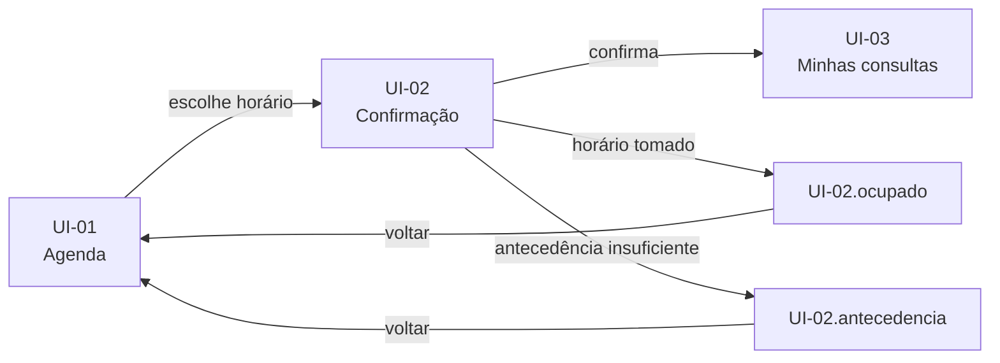

# Modelo — SPEC-UI

Documento gerado pela skill `sdd-prototype`, salvo em `docs/sdd/prototype/SPEC-UI-XXX-tema.md` com **o mesmo número do PRD**.

Tamanho esperado: proporcional às telas. Quatro telas cabem em umas 120 linhas; quinze, em umas 400. Se passar muito disso, o PRD provavelmente deveria ter sido dividido.

> Sobre as cercas: as quatro crases externas apenas delimitam o modelo; as cercas de três crases internas fazem parte do documento.

---

````markdown
# SPEC-UI-XXX: [mesmo título do PRD]

- **PRD:** `docs/sdd/prds/PRD-XXX-tema.md`
- **Arquitetura:** `docs/sdd/architecture/proposta-arquitetural.md`
- **Modo:** [Ingestão / Geração / Misto]
- **Protótipo:** [caminho em `docs/sdd/prototype/assets/` ou URL]
- **Fidelidade:** [Wireframe / Alta fidelidade]
- **Responsável:** [nome]
- **Data:** [AAAA-MM-DD]
- **Status:** Rascunho

---

## 1. Contexto

- **Tipo de interface:** [painel administrativo | site institucional | app de operação | loja | portal | ferramenta interna]
- **Dispositivo principal:** [desktop primeiro | celular primeiro | só celular | responsivo completo]
- **Tecnologia de frontend:** [da arquitetura/config — ex.: Rails 8 + Hotwire (Turbo/Stimulus) + Tailwind + ViewComponent]

**De onde veio cada informação**

| Fonte | Contribuição |
| --- | --- |
| Protótipo | [ex.: 5 telas, campos e hierarquia] |
| PRD | [ex.: estados de erro tirados dos cenários CA-03 e CA-05] |
| Arquitetura / config | [ex.: Hotwire, exigência de acessibilidade] |
| Conversa | [ex.: navegação entre telas, cor primária] |

---

## 2. Tokens visuais

[Só os conhecidos. Valores tirados de imagem são aproximados e marcados assim.
Se o repositório já tem design system, aponte o arquivo e não copie valores.]

| Token | Valor | Origem |
| --- | --- | --- |
| Cor primária | `#0F766E` | Protótipo HTML |
| Fundo | `#FFFFFF` | Protótipo HTML |
| Cor de erro | `#B91C1C` | Aproximado (imagem) |
| Fonte | Inter | Protótipo HTML |
| Unidade de espaçamento | 4px | Conversa |

> Com design system no repositório: `Ver app/assets/tailwind/application.css — valores não repetidos aqui.`

---

## 3. Lista de telas

Panorama; o detalhe vem na seção 4.

| ID | Tela | Rota | Perfil | Regras (RN) | Cenários (CA) |
| --- | --- | --- | --- | --- | --- |
| UI-01 | Agenda do médico | `/agendas/:medico_id` | Paciente | RN-01, RN-02 | CA-01, CA-02 |
| UI-02 | Confirmação do horário | `/consultas/new` | Paciente | RN-03, RN-04 | CA-03, CA-05 |
| UI-03 | Minhas consultas | `/consultas` | Paciente | RN-11 | CA-11 |
| UI-04 | Painel da recepção | `/recepcao/agenda` | Recepcionista | RN-10, RN-12 | CA-10, CA-12 |

---

## 4. Cada tela

### UI-01 — [nome]

- **Para que serve:** [uma linha]
- **Rota:** `/caminho`
- **Quem acessa:** [perfil da seção 5 do PRD]

**Regras visíveis**

| Regra | Como o usuário percebe |
| --- | --- |
| RN-02 | Horários a menos de 2h do momento atual aparecem esmaecidos e não clicáveis |

**Estados**

| Estado | ID | Quando acontece | O que aparece | Origem |
| --- | --- | --- | --- | --- |
| Padrão | `UI-01.default` | Há horários livres | Grade de horários por dia | Protótipo |
| Sem horários | `UI-01.vazio` | Nenhum horário livre na semana | Mensagem + atalho para a próxima semana | Protótipo |
| Carregando | `UI-01.carregando` | Troca de semana em andamento | Placeholder da grade (Turbo Frame) | Derivado do PRD |
| Falha | `UI-01.erro` | Agenda não carregou | Aviso + "Tentar de novo" | Derivado do PRD |

**Elementos que importam**
- [elemento — comportamento relevante em uma linha]

**Para onde se vai daqui**
- Horário livre → `UI-02`
- Semana sem horários → próxima semana, mesma tela

**Notas:** [decisão de UX que merece registro, ou o que ficou indefinido]

---

### UI-02 — [nome]

[mesma estrutura]

---

## 5. Componentes repetidos

O que aparece em mais de uma tela — serve para o plano criar **uma** tarefa por componente, e não uma por tela.

| Componente | Telas | O que é | Estados |
| --- | --- | --- | --- |
| `SlotHorarioComponent` | UI-01, UI-04 | Bloco de horário clicável | livre, ocupado, indisponível |
| `StatusConsultaComponent` | UI-03, UI-04 | Selo de situação da consulta | confirmada, cancelada, realizada |
| `ConfirmacaoDialog` | UI-02, UI-04 | Diálogo para ações que não têm volta | default, processando |

---

## 6. Navegação



---

## 7. Cobertura do PRD

Onde cada regra e cada cenário aparece na interface.

### Regras

| RN | Aparece em | Situação |
| --- | --- | --- |
| RN-01 | UI-01, UI-04 | ✅ Coberta |
| RN-04 | UI-02 (`.ocupado`) | ✅ Coberta |
| RN-08 | — | ⚠️ Regra de backend (nova tentativa no convênio) — sem tela neste PRD |

### Cenários

| CA | Acontece em | Situação |
| --- | --- | --- |
| CA-01 | UI-01 → UI-02 → UI-03 | ✅ Coberto |
| CA-05 | UI-02 (`.ocupado`) | ✅ Coberto |
| CA-12 | — | ❌ **Sem tela** — bloqueio de cancelamento de consulta realizada não está no protótipo |

---

## 8. Lacunas

Cada item precisa de decisão antes do plano — ou de aceite explícito como fora do escopo.

| # | Lacuna | Efeito | Decisão pendente |
| --- | --- | --- | --- |
| 1 | CA-12 sem tela | Cenário sem lugar para acontecer | Criar estado na UI-04, mover para outro PRD ou tratar como backend |
| 2 | Estados de erro não estavam no protótipo | Derivados do PRD, sem validação de design | Validar com design antes de implementar |
| 3 | Cores tiradas de imagem | Implementação pode divergir | Obter valores exatos ou aceitar aproximação |

---

## 9. Restrições de interface

[Da arquitetura e da conversa. Sem restrições, remova a seção.]

- [ex.: contraste mínimo WCAG AA]
- [ex.: funciona sem JavaScript nas telas de leitura]
- [ex.: usar só os componentes do design system existente]
````

---

## Como preencher bem

**Origem (seção 1).** É o que torna o documento confiável. Estado marcado como "derivado do PRD" avisa ao dev e a quem desenha que aquilo ainda não foi validado visualmente.

**Tokens (seção 2).** Havendo design system, aponte o arquivo. Copiar valores para o markdown garante divergência na primeira mudança de paleta. E todo valor tirado de imagem é aproximado — diga isso.

**Estados (seção 4).** É onde mora o maior valor do documento; o catálogo e os mínimos por tipo de tela estão em `screen-states.md`. O sufixo do ID (`UI-02.ocupado`) permite à tarefa declarar `Telas: UI-02 (default, ocupado, antecedencia)` e ao review conferir um a um.

**Componentes (seção 5).** Sem esta seção, o plano cria "implementar bloco de horário" na agenda e de novo no painel da recepção. Com ela, cria uma tarefa de componente e duas de composição.

**Cobertura (seção 7).** Percorrer o PRD e perguntar "onde isto aparece?" revela buracos que ninguém vê olhando só o protótipo. Regra sem tela pode ser legítima (backend), mas precisa estar escrita como tal.

**Lacunas (seção 8).** Nada é resolvido em silêncio. Se um cenário não tem tela, a skill não desenha uma por conta própria para fechar a tabela — registra e pede decisão. Uma matriz incompleta e honesta vale mais que uma completa e inventada.
