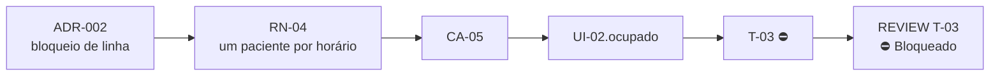

# sdd-trace — matriz de rastreabilidade

Entrada: $ARGUMENTS (se o seu ambiente não substituir essa variável, use a mensagem do usuário).

Mostra, de uma vez, como cada decisão, regra, cenário, tela e tarefa se ligam — e, principalmente, **onde a corrente se rompe**. É uma análise estática dos artefatos: só conta o que está escrito.

## Passo 1 — Reunir os artefatos

Sem um PRD indicado na entrada, procure (convenções em `${CLAUDE_PLUGIN_ROOT}/templates/folder-conventions.md`):

- **ADRs:** `docs/sdd/architecture/adrs/ADR-*.md` (e o índice da proposta)
- **PRDs:** `docs/sdd/prds/PRD-*.md`
- **SPEC-UI:** `docs/sdd/prototype/SPEC-UI-*.md` — opcional
- **Planos:** `docs/sdd/plans/PLAN-*.md`
- **Reviews:** `docs/sdd/reviews/REVIEW-*.md`
- **Testes:** os diretórios de teste do projeto (de `docs/sdd/config.yml`; em Rails, normalmente `spec/` ou `test/`)

Com mais de um PRD, pergunte qual analisar. Um por vez.

## Passo 2 — Extrair os IDs

**Do PRD:** `RN-\d+`; títulos `Cenário [CA-\d+]:` (e `Esquema do Cenário [CA-\d+]:`); ADRs citados (`ADR-\d{3}`).

**Dos ADRs:** o ID de cada arquivo e o `**Status:**` (`Proposto` / `Aceito` / `Substituído por ADR-XXX` / `Descontinuado`).

**Do plano:** cada bloco `#### T-XX` com `Implementa`, `Valida`, `Decisões base`, `Telas` e `**Status:**`. Cuidados de leitura:
- o `Status:` do cabeçalho é do documento — só contam os que estão dentro de um bloco de tarefa;
- o bloco da tarefa é a verdade; a tabela de histórico é o registro. Se discordarem, é inconsistência a reportar, não algo para você decidir;
- valor fora do vocabulário (`Pendente` / `Em andamento` / `Concluído` / `Bloqueado` / `Cancelado`, ou o equivalente em `en` conforme `config.yml`) é um gap — reporte a grafia encontrada.

**Da SPEC-UI (se houver):** `UI-XX`, estados (`UI-XX.estado`), as `RN`/`CA` de cada tela e as lacunas da seção 8. Sem SPEC-UI, **não é lacuna** — apenas omita as colunas de interface.

**Dos reviews:** arquivos `REVIEW-T-XX-*.md`, cada `R-XX` com severidade e a recomendação final. Como `R-XX` recomeça em cada arquivo, guarde sempre o par número + arquivo.

**Dos testes:** procure cada `CA-XX` nos diretórios de teste, no formato de nome configurado (ex.: `CA-05` em `it "CA-05: ..."`). Encontrar o ID no teste é o que fecha o último elo.

**Revogados e cancelados:** `RN`, `CA` e `UI` riscados (revogados) saem da cobertura — não são cobrados nem contam como elo quebrado; aparecem numa linha própria da matriz, com o ID que os substitui. Tarefas `Cancelado` também não cobrem nada: o `CA` que só elas validavam é apontado no Passo 4.

## Passo 3 — Montar a matriz

Três tabelas e um diagrama.

### Tabela 1 — Da regra ao review

| RN | Regra (resumo) | Provada por (CA) | Feita em (T) | Decisão (ADR) | Review |
| --- | --- | --- | --- | --- | --- |
| RN-02 | Antecedência mínima de 2h | CA-02 | T-03 | — | T-03 ✅ Aprovado |
| RN-04 | Um paciente por horário | CA-05 | T-03 | ADR-002 | T-03 ⚠️ R-02 (REVIEW-T-03-2026-10-09) em aberto |

### Tabela 2 — Do cenário ao teste

| CA | Cenário | Prova (RN) | Tela (UI) | Feito em (T) | Teste | Review |
| --- | --- | --- | --- | --- | --- | --- |
| CA-01 | Agenda em horário livre | RN-01 | UI-02.default | T-05 | `spec/requests/consultas_spec.rb` | ✅ |
| CA-05 | Disputa pelo último horário | RN-04 | UI-02.ocupado | T-03 | não encontrado | ⛔ R-01 (REVIEW-T-03-2026-10-09) |

> A coluna **Tela (UI)** só existe quando há SPEC-UI.

### Tabela 3 — Execução por tarefa

A coluna de status copia o texto do plano, sem traduzir nem enfeitar.

| Tarefa | Status no plano | Tem review? | Pior severidade | Apontamentos em aberto |
| --- | --- | --- | --- | --- |
| T-01 | Concluído | Sim | — | 0 |
| T-03 | Bloqueado | Sim | Bloqueante | R-01, R-02 (REVIEW-T-03-2026-10-09) |
| T-05 | Em andamento | Não | — | — |

### Diagrama

## Passo 4 — Listar os elos quebrados

Para cada item, diga onde está e qual o risco:

- **Regra sem cenário** — `RN` que nenhum `CA` prova → regra sem teste.
- **Cenário sem tarefa** — `CA` que nenhuma tarefa valida → critério órfão.
- **Cenário sem teste** — `CA` cujo ID não aparece em nenhum teste → cobertura só no papel.
- **Tarefa sem rastro** — sem `Implementa` nem `Valida` e sem a marca `estrutural` → propósito pouco claro. Tarefa com `Implementa: estrutural — <motivo>` é legítima e não entra aqui.
- **Cenário só com tarefa cancelada** — `CA` em vigor cujas únicas tarefas estão `Cancelado` → o escopo foi revogado no plano e não no PRD, ou falta a tarefa nova.
- **Revisão sem registro** — PRD ou SPEC-UI com ID riscado (revogado) que não aparece com `−` em nenhuma linha da seção **Revisões** → mudança que ninguém consegue rastrear.
- **ADR citado e inexistente** — referência quebrada.
- **ADR que ninguém cita** — decisão sem efeito rastreável (sinal possível de excesso de engenharia).
- **Tarefa apoiada em ADR não aceito** — `Decisões base` aponta ADR `Proposto`, `Substituído` ou `Descontinuado`.
- **Tarefa concluída sem review** — entrega não validada.
- **Review bloqueado sem round seguinte** — trabalho parado.
- **Bloqueante aberto em tarefa `Concluído`** — **contradição grave** entre o declarado e o verificado.
- **Status fora do vocabulário** — tarefa invisível para `sdd-next` e para esta skill; mostre a grafia.
- **Status diferente do histórico** — registro de execução não confiável.

Com SPEC-UI, também:

- **Cenário de interface sem tela** — não tem onde acontecer.
- **Tela sem tarefa** — tela órfã.
- **Estado sem tarefa** — `UI-02.ocupado` especificado, nenhuma tarefa o declara em `Telas:` → caminho de erro sem tratamento.
- **Tela sem RN nem CA** — escopo extra ou PRD incompleto.
- **Lacunas da SPEC-UI ainda abertas** (seção 8).

## Passo 5 — Salvar (se o usuário quiser)

Pergunte se deve gravar em `docs/sdd/traceability/MATRIX-XXX-tema.md` (mesmo número do PRD). A matriz é uma fotografia: quando PRD ou plano mudarem, gere de novo.

## Regra de ouro

Nada de completar elos por dedução. Tarefa sem `Implementa` é gap, mesmo que dê para "adivinhar" a regra. Tarefa `Concluído` sem review é gap, mesmo que o código pareça bom. Uma matriz incompleta e honesta é informação; uma matriz completa e inventada é armadilha.
