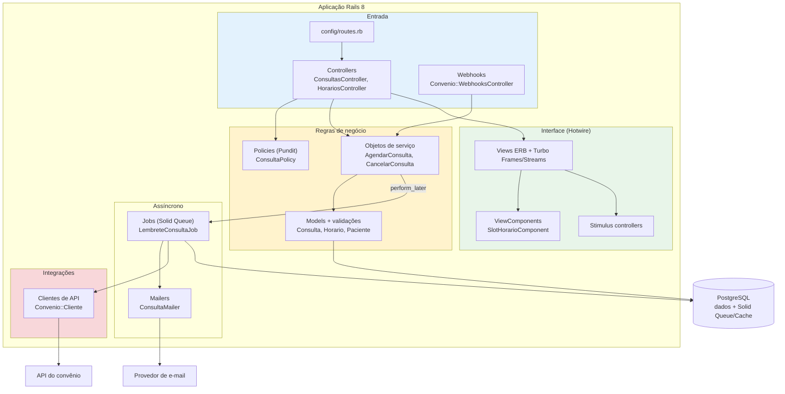

# C4 nível 3 — componentes de uma aplicação Rails

Versão concreta do diagrama de componentes de `skills/sdd-architect/references/c4-mermaid-templates.md`, para a aplicação de agendamento de consultas.

É **um** jeito comum de organizar um Rails de porte médio — regra de negócio em objetos de serviço, autorização em policies, interface com Hotwire. Não é recomendação: uma aplicação Rails "clássica", com a regra nos models, é igualmente válida quando o domínio é simples. A escolha de organização é decisão do projeto, registrada em ADR.

## Leitura do diagrama

- **Controllers são finos:** autorizam (policy), chamam um serviço e escolhem a resposta. A regra fica em `Regras`.
- **Efeitos externos saem da requisição:** e-mails e chamadas ao convênio rodam em jobs, enfileirados depois do commit.
- **Integrações isoladas:** só `Convenio::Cliente` conhece a API externa; o resto do sistema usa a interface dele.
- **Um banco para tudo:** dados, filas (Solid Queue) e cache (Solid Cache) no PostgreSQL — coerente com o ADR que dispensou Redis.

## Variações comuns

| Situação | O que muda no diagrama |
| --- | --- |
| Domínio simples | Some o grupo de serviços; a regra fica nos models |
| Módulos com packwerk/engines | Cada pack vira um `subgraph` com sua API pública e setas só por ela |
| API-only | Some o grupo `Interface`; entram serializadores (Jbuilder/Alba) |
| Sidekiq em vez de Solid Queue | Jobs passam a depender de um Redis externo |
