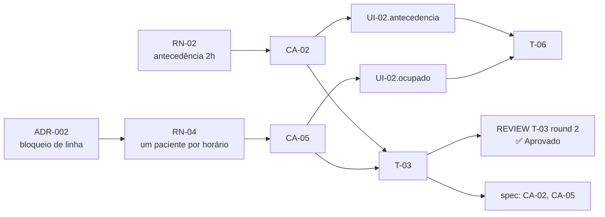

# Exemplo completo — uma demanda atravessando o pipeline (Rails)

Uma demanda fictícia percorrendo todas as fases do pipeline SDD, com os IDs se cruzando de uma fase para a outra. O objetivo é **mostrar as costuras**: como um ADR é citado no PRD, como um cenário vira estado de tela, como a tarefa declara tudo isso e como o review devolve a tarefa ao plano.

São **trechos** de cada artefato, não os documentos inteiros. A estrutura completa de cada documento está nos modelos das skills (`skills/*/references/`) — se este exemplo e um modelo divergirem, vale o modelo.

O código é Rails real (Rails 8, PostgreSQL, Hotwire, RSpec) para dar concretude. O que se calibra aqui é o cruzamento dos IDs, não a stack.

## A demanda

> **Produto:** sistema de agendamento de uma rede de clínicas
> **Pedido:** permitir que pacientes agendem consultas pelo site. Cada horário de um médico só pode ter um paciente. É preciso marcar com pelo menos 2 horas de antecedência. Hoje a recepção perde tempo ao telefone e, nos horários disputados, já aconteceu de dois pacientes serem marcados no mesmo horário.

---

## 1. Decisão de arquitetura — `sdd-architect`

Arquivo `docs/sdd/architecture/adrs/ADR-002-bloqueio-de-linha-no-agendamento.md`:

````markdown
# ADR-002: Usar bloqueio de linha no PostgreSQL para reservar horários

- **Status:** Aceito
- **Data:** 2026-10-01
- **Responsável:** Time Agenda
- **Proposta:** [../proposta-arquitetural.md](../proposta-arquitetural.md)

## Contexto

Nas segundas de manhã, a abertura da agenda semanal concentra dezenas de pacientes
tentando os mesmos horários. Já houve consultas duplicadas no mesmo horário porque a
verificação "horário livre?" e a criação da consulta aconteciam em momentos separados.
Consulta duplicada gera paciente sem atendimento e retrabalho da recepção.

## Decisão

A confirmação de uma consulta abre uma transação, bloqueia a linha do horário
(`Horario#lock!`, `SELECT ... FOR UPDATE`) e só então verifica se ele está livre e cria
a consulta. Um índice único em `consultas(horario_id)` (parcial, para situações ativas)
garante a regra mesmo se algum caminho esquecer o bloqueio.

## Motivos

Consistência forte é a qualidade prioritária desta funcionalidade. O volume previsto
(algumas dezenas de confirmações simultâneas por médico) cabe com folga num bloqueio de
linha, e o time já opera PostgreSQL — nenhum componente novo.

## Opções descartadas

### Bloqueio otimista (`lock_version`) com nova tentativa
- **Em resumo:** detectar conflito na gravação e tentar de novo.
- **Por que não:** no pico, a maioria das tentativas conflitaria; a experiência seria
  uma sequência de erros genéricos.

### Fila única de confirmações (job serial por médico)
- **Em resumo:** enfileirar confirmações e processar uma a uma.
- **Por que não:** o paciente esperaria a fila para saber o resultado; complexidade alta
  para o volume atual.

## Consequências

### O que melhora
- Fim das consultas duplicadas, sem infraestrutura nova.

### O que piora ou fica para depois
- **Dívida:** o bloqueio serializa confirmações do mesmo horário.
  - **Vira problema quando:** a espera por bloqueio passar de ~200ms no p95.
  - **Como resolver:** reavaliar com métricas (T-10 instrumenta isso).
````

A proposta arquitetural apenas lista este ADR no índice da seção 5.

---

## 2. Requisitos — `sdd-prd`

Trecho de `docs/sdd/prds/PRD-001-agendamento-online.md`:

````markdown
## 8. Regras de negócio — obrigatória

- **RN-01:** O paciente só vê e escolhe horários livres da agenda publicada do médico.
- **RN-02:** Uma consulta só pode ser marcada com pelo menos 2 horas de antecedência.
- **RN-03:** Paciente com duas faltas sem aviso no mês corrente não agenda pelo site.
- **RN-04:** Um horário comporta uma única consulta ativa. (ADR-002)

## 9. Critérios de aceite — obrigatória

```gherkin
# language: pt
Funcionalidade: Agendamento online

  Cenário [CA-01]: Paciente agenda em horário livre
    Dado que estou autenticado como paciente
    E a Dra. Ana tem o horário de amanhã às 14:00 livre (RN-01)
    Quando confirmo esse horário
    Então a consulta fica "Confirmada"
    E o horário deixa de aparecer como livre

  Cenário [CA-02]: Agendamento com menos de 2 horas é recusado
    Dado que agora são 13:10
    E a Dra. Ana tem o horário de hoje às 14:00 livre
    Quando tento confirmar esse horário
    Então o agendamento é recusado (RN-02)
    E vejo "Agendamentos exigem 2 horas de antecedência"

  Cenário [CA-05]: Dois pacientes confirmam o último horário ao mesmo tempo (ADR-002)
    Dado que a Dra. Ana tem apenas o horário das 16:00 livre (RN-04)
    E Bruno e Carla confirmam esse horário no mesmo instante
    Quando as duas confirmações são processadas
    Então exatamente uma consulta é criada
    E a outra pessoa vê "Este horário acabou de ser ocupado"
```
````

O `RN-04` cita o `ADR-002`, e o `CA-05` traz o ADR no título porque o comportamento esperado depende da decisão de arquitetura.

---

## 3. Interface — `sdd-prototype` (opcional)

Existe porque a demanda tem tela. Repare: os estados `.antecedencia` e `.ocupado` **não estavam no protótipo** — foram derivados dos `Então` de recusa dos cenários.

Trecho de `docs/sdd/prototype/SPEC-UI-001-agendamento-online.md`:

````markdown
## 3. Lista de telas

| ID | Tela | Rota | Perfil | Regras (RN) | Cenários (CA) |
| --- | --- | --- | --- | --- | --- |
| UI-01 | Agenda do médico | `/medicos/:medico_id/horarios` | Paciente | RN-01 | CA-01 |
| UI-02 | Confirmação do horário | `/horarios/:horario_id/consultas/new` | Paciente | RN-02, RN-04 | CA-01, CA-02, CA-05 |

### UI-02 — Confirmação do horário

**Estados**

| Estado | ID | Quando acontece | O que aparece | Origem |
| --- | --- | --- | --- | --- |
| Padrão | `UI-02.default` | Horário livre | Resumo + "Confirmar" | Protótipo |
| Enviando | `UI-02.enviando` | Confirmação em andamento | Botão bloqueado | Protótipo |
| Antecedência | `UI-02.antecedencia` | Menos de 2h (RN-02) | Aviso + volta para a agenda | Derivado do CA-02 |
| Ocupado | `UI-02.ocupado` | Outra pessoa confirmou antes (RN-04) | Aviso + próximos horários livres | Derivado do CA-05 |
````

---

## 4. Plano — `sdd-plan`

Trecho de `docs/sdd/plans/PLAN-001-agendamento-online.md`:

````markdown
#### T-03 — Agendar consulta garantindo um paciente por horário

- **Status:** Pendente
- **Complexidade:** Alta
- **Estimativa:** 5h
- **Depende de:** T-01, T-02
- **Implementa:** RN-02, RN-04
- **Valida:** CA-02, CA-05
- **Decisões base:** ADR-002
- **Arquivos/camadas:**
  - `app/services/agendar_consulta.rb` *(novo)*
  - `db/migrate/20261005120000_add_unique_index_to_consultas.rb` *(novo)*
  - `spec/services/agendar_consulta_spec.rb` *(novo)*

**O que fazer:**
Serviço `AgendarConsulta` que abre transação, bloqueia o horário com `lock!`, verifica a
antecedência e se o horário segue livre, e cria a consulta confirmada. Índice único parcial
como segunda barreira. Retorna um resultado (`sucesso?`, `erro`) em vez de levantar exceção
de negócio, como o resto do projeto.

**Critério de aceite (testável):**
- [ ] CA-02 verde: menos de 2h → resultado com erro `:antecedencia`
- [ ] CA-05 verde: 10 confirmações simultâneas no mesmo horário → 1 consulta criada
- [ ] Erro técnico (ex.: `ActiveRecord::LockWaitTimeout`) não vira erro de negócio

**Testes a escrever:**
- *Serviço:* `it "CA-02: recusa com menos de 2 horas de antecedência"`
- *Concorrência:* `it "CA-05: confirmações simultâneas criam uma única consulta"`

#### T-06 — Tela de confirmação com estados de recusa

- **Status:** Pendente
- **Complexidade:** Média
- **Estimativa:**
- **Depende de:** T-05
- **Implementa:** —
- **Valida:** CA-01, CA-02, CA-05
- **Decisões base:** —
- **Telas:** UI-02 (default, enviando, antecedencia, ocupado)
````

A estimativa `5h` da T-03 foi **informada pelo usuário** depois de ver a sugestão do `sdd-plan` (que propôs 4h). A T-06 ficou sem estimativa porque o usuário não informou valor.

Como o serviço da T-03 fica em Rails:

```ruby
# app/services/agendar_consulta.rb
class AgendarConsulta
  ANTECEDENCIA_MINIMA = 2.hours

  Resultado = Data.define(:consulta, :erro) do
    def sucesso? = erro.nil?
  end

  def self.call(...) = new(...).call

  def initialize(paciente:, horario:)
    @paciente = paciente
    @horario = horario
  end

  def call
    return falha(:antecedencia) if @horario.inicia_em < ANTECEDENCIA_MINIMA.from_now # RN-02

    # Sem `return` dentro do bloco: o valor do bloco é o retorno da transação.
    Consulta.transaction do
      @horario.lock! # ADR-002: SELECT ... FOR UPDATE

      if @horario.consultas.ativas.exists? # RN-04
        falha(:ocupado)
      else
        consulta = @horario.consultas.create!(paciente: @paciente, situacao: :confirmada)
        Resultado.new(consulta:, erro: nil)
      end
    end
  rescue ActiveRecord::RecordNotUnique
    falha(:ocupado) # índice único: segunda barreira do RN-04
  end

  private

  def falha(motivo) = Resultado.new(consulta: nil, erro: motivo)
end
```

---

## 5. Execução — `sdd-execute`

`/sdd-execute T-03` carrega `RN-02`, `RN-04`, `CA-02`, `CA-05` do PRD e o arquivo do `ADR-002` (confere que está `Aceito`), marca `Em andamento`, escreve os testes primeiro, implementa e roda `bin/rails zeitwerk:check` e `bundle exec rspec spec/services/agendar_consulta_spec.rb`. Tudo verde: marca `Concluído`, registra no histórico e entrega, em texto, a mensagem de commit no padrão do `config.yml` (aqui, Conventional Commits): `feat(agenda): bloqueia horário já ocupado (T-03)`. O commit fica com o usuário.

O teste de concorrência que fecha o `CA-05`:

```ruby
# spec/services/agendar_consulta_spec.rb
# `:sem_transacao` é um metadado do projeto que desliga a transação automática do
# exemplo, para que as threads enxerguem os mesmos dados (e limpa o banco ao final).
RSpec.describe AgendarConsulta do
  describe "concorrência", :sem_transacao do
    it "CA-05: confirmações simultâneas criam uma única consulta" do
      horario = create(:horario, inicia_em: 1.day.from_now)
      pacientes = create_list(:paciente, 10)

      threads = pacientes.map do |paciente|
        Thread.new do
          ActiveRecord::Base.connection_pool.with_connection do
            AgendarConsulta.call(paciente:, horario: Horario.find(horario.id))
          end
        end
      end
      resultados = threads.map(&:value)

      expect(resultados.count(&:sucesso?)).to eq(1)
      expect(Consulta.where(horario:).count).to eq(1)
    end
  end
end
```

---

## 6. Review — `sdd-review`

Suponha que a primeira versão da T-03 tenha esquecido o `rescue ActiveRecord::RecordNotUnique`. Trecho de `docs/sdd/reviews/REVIEW-T-03-2026-10-09.md`:

````markdown
- **Recomendação:** ⛔ Bloqueado

#### R-01 — Violação do índice único vira erro 500

- **Eixo:** 3 Especificação
- **Ligado a:** RN-04, CA-05, ADR-002
- **Onde:** `app/services/agendar_consulta.rb:18-27`
- **O que está errado:** o painel da recepção também cria consultas, sem passar por este
  serviço. Quando as duas coisas acontecem no mesmo horário, o índice único dispara
  `ActiveRecord::RecordNotUnique`, que não é tratado: o paciente recebe erro genérico em
  vez de "Este horário acabou de ser ocupado".
- **Por que bloqueia:** o CA-05 exige a mensagem de horário ocupado; o ADR-002 define o
  índice como segunda barreira, então a exceção é caminho previsto, não falha técnica.
- **Caminho sugerido:** tratar `RecordNotUnique` devolvendo `falha(:ocupado)`.
````

Como há um Bloqueante, o `sdd-review` devolve o resultado ao plano (com confirmação do usuário):

````markdown
#### T-03 — Agendar consulta garantindo um paciente por horário

- **Status:** Bloqueado

| Tarefa | Status | Data | Commit | Observação |
| --- | --- | --- | --- | --- |
| T-03 | Bloqueado | 2026-10-09 | `4f2a9c1` | R-01 (REVIEW-T-03-2026-10-09) |
````

Depois da correção, `/sdd-review T-03` gera `REVIEW-T-03-2026-10-10-round2.md`, marca o `R-01 (round 1)` como resolvido na seção "Round anterior", e a tarefa volta a `Concluído`.

---

## 7. Rastreabilidade — `sdd-trace`



| CA | Prova (RN) | Tela (UI) | Feito em (T) | Teste | Review |
| --- | --- | --- | --- | --- | --- |
| CA-02 | RN-02 | UI-02.antecedencia | T-03, T-06 | `spec/services/agendar_consulta_spec.rb` | ✅ (round 2) |
| CA-05 | RN-04 | UI-02.ocupado | T-03, T-06 | `spec/services/agendar_consulta_spec.rb` | ✅ (round 2) |

O elo final — `CA-05` no nome do teste — é o que permite ao `sdd-trace` confirmar que o cenário tem prova real, e não só uma menção no plano.
